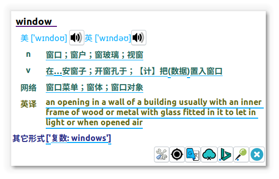
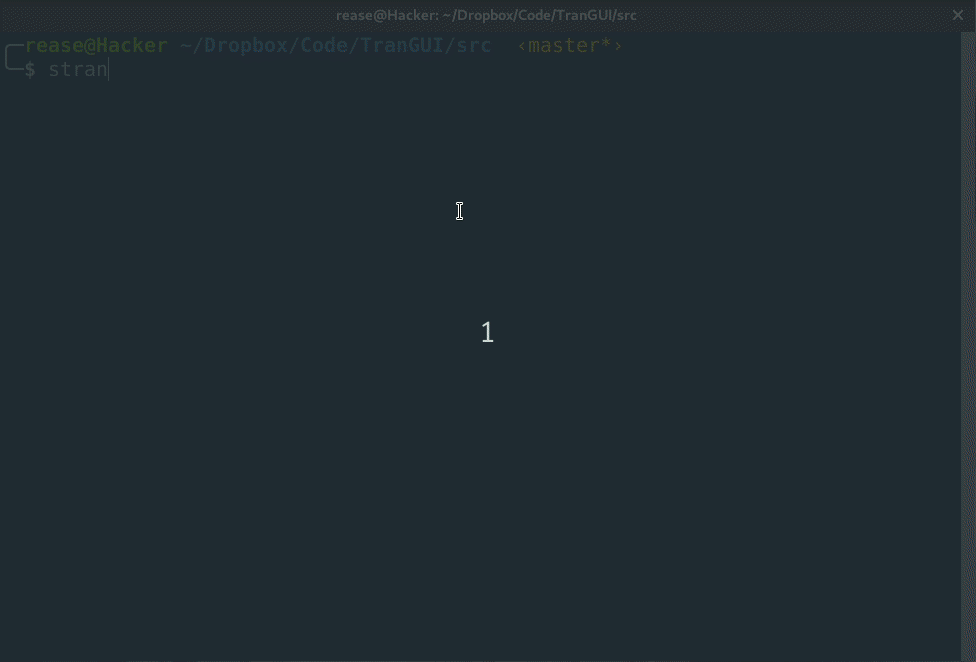

#### 新添加快速搜索功能，取消了检测GUI单行文本占用像素点（因GTK相关函数已经无法准确获取任何信息），如果音频按钮偏移，可以修改源码适应系统。包括其他相关源码修改位置稍后加上。

### 本次更新较大，如果软件有问题，欢迎提issue，作者会尽早解决。

# 一. 程序功能
## (一). 目前功能
### 1. 屏幕取词翻译 -- 中英互译 （全局）
### 2》 快速搜索功能 -- 快捷键调出搜索框，输入后回车获取翻译（全局）
   
  #### Ubuntu 19.04 测试通过:

   

  #### Arch Linux 测试通过:

   <br><br>
    


### 按键功能说明: 
* 切换谷歌百度翻译


## (二). 后期预计完成功能
1. 单词收藏
2. 离线翻译
 
 <br> 


# 二. 运行效果图示 
* [x] 终端演示<br><br>
 <br><br>

* [x] 浏览器演示<br><br>
 

<br> 

* [x] 快速查找功能 \<Alt-J> 触发， Ctrl-C 或 ESC 关闭，翻译界面只支持ctrl-C关闭，窗口失焦状态ctrl-c同样适用，要关闭此功能需修改源码，后期发布详情 （修改源码可更改快捷键）<br><br>


<br>

# 三. 程序目前已知问题

- [ ] **程序只支持Xorg的桌面，并且系统必须禁用Wayland。** 

<br> 

# 四. 程序编译安装
1. 先将源码克隆到本地 

        $ git clone https://github.com/poemdistance/ScreenTranslation --recursive

    如果代码已经下载过一次并做了修改，需要同步到上游到最新状态覆盖本地的，参考：
    [Git 下游更改后强行恢复至上游最新状态, 更新submodules至最新状态](https://poemdear.com/2019/08/29/git-%e4%b8%8b%e6%b8%b8%e6%9b%b4%e6%94%b9%e5%90%8e%e5%bc%ba%e8%a1%8c%e6%81%a2%e5%a4%8d%e8%87%b3%e4%b8%8a%e6%b8%b8%e6%9c%80%e6%96%b0%e7%8a%b6%e6%80%81-%e6%9b%b4%e6%96%b0submodules%e8%87%b3%e6%9c%80/)
  

2. cd到src目录  

        $ cd ScreenTranslation/src
   
3. 安装依赖  Xlib X11 Xtst Xext gtk3开发环境(gtk.h, gtkwindow.h)
 
   * For system base on Debian  (Ubuntu, Kali etc.)

          $ sudo apt-get install build-essential gnome-devel libx11-dev libxtst-dev
          $ sudo apt-get install python3-pip
          $ sudo apt-get install xdotool

   * For Arch Linux 

          $  sudo pacman -S gtk3  libxtst libx11  xdotool    

  
4. 终端执行命令完成项目安装 (**以下可用 `bash prepare.sh` `make && make install` 两个命令代替,如果这个命令执行后未能正常运行，尝试以下具体步骤, <font color='red'>注意安装好后必须重启</font>**) <br>
   
   * 复制资源文件 

          $ mkdir ~/.stran
          $ cp ../gif_pic/tran.png ../gif_pic/Switch.png ../gif_pic/background.jpg errNotification.sh startup.sh ../gif_pic/volume.png ~/.stran -v

   * 修改源码适应用户 
  
          $ echo $HOME         #记下这个结果输出 

          $ sed -i 's/\/home\/rease/<上一个命令的输出结果>/g' GuiEntrance.c newWindow.c background.c  audioPlayer.c  Mstran.desktop switchButton.c  
          #不要带上尖括号. 记得在斜杠前加反斜杠

          #如: sed -i 's/\/home\/rease/\/home\/username/g' GuiEntrance.c newWindow.c background.c  audioPlayer.c  Mstran.desktop switchButton.c 

   * 添加桌面图标,创建日志文件

           #复制启动图标，创建日志文件,修改读写权限，(**启动图标的生效可能要等计算机重启或gnome shell重启**)

            sudo cp Mstran.desktop /usr/share/applications/ -v
            sudo touch /var/log/mstran.log
            sudo chmod -c 750 /var/log/mstran.log
            sudo chown -c $USER /var/log/mstran.log


   * 添加用户到 `/dev/input/mice` 所在组: 
    
         $ sudo usermod -aG `ls -l /dev/input/mice | awk '{print $4}' | xargs` $USER  
         #需要重启

   * 编译源码并安装 
    
          $ sudo make && make install

5. 依赖项目安装

      a. 返回项目根目录 `ScreenTranslation/` 
   
     b. 依次 cd 进 `baidu-translate/` 以及 `google-translate/` 
         
    c. 执行以下命令完成百度翻译和谷歌翻译命令行版本的安装

         $ pip3 install -r requirements.txt

         $ sudo ./setup.py install 
        
6. 请务必阅读下面的使用注意事项

# 五. 使用过程中的问题
 
1. 运行后长时间未使用软件，在第一次双击后可能会不弹出图标，或者翻译结果呈现上一次未知的复制，是因为复制操作有延时，程序获取成了上一次的复制结果
 
2. 程序有较小几率呈现出上一次的翻译结果，原因是上一次结果获取较慢，直到在这一次中才呈现出来，打乱了步伐

3. 程序有较小几率显示不完美，也跟翻译速度影响有关

4. 百度或者谷歌翻译如果在翻译过程中出了问题，可能是网络原因，也可能是代码本身的Bug，由于翻译结果的不确定性，不保证已经将全部因素考虑进去，有可能翻译某些特定情况的时候使程序奔溃，重启便可。如果多次选中同一个文本都产生崩溃，那便是代码的问题。如果重启后一切恢复，便是网络问题，即有可能是网络不好，或者百度的反爬虫机制导致的。

5. 如果想协助作者完善此软件，请在程序崩溃后将日志文件 `/var/log/mstran.log`发送至作者github同名gmail邮箱:`poemdistance@gmail.com` 
 
6. 软件是有桌面图标的，安装成功并重启后按Super键，搜索Mstran即可找到，点击图标会打开或者重启翻译软件。


# 六. 更新上游项目并安装

## 1. 项目更新 

步骤一.

          #注意这条命令自始至终只需要在项目中执行一次

          git remote add upstream https://github.com/poemdistance/ScreenTranslation  

步骤二.
          
          #注意以下命令会覆盖掉本地已有的修改

          git fetch upstream
          git checkout master
          git reset --hard upstream/master

步骤三.

          git submodule foreach git pull origin master 

## 2. 项目安装

步骤四. <编译/安装项目> 

        参照上面的安装步骤 2  4  5  （更新不需要重启)


<br> 

# 七. 程序运行与停止
1. 运行**先决条件** <br>
     * **安装这个项目 https://github.com/poemdistance/google-translate 以及这个项目 https://github.com/poemdistance/baidu-translate 上的在线翻译程序**，其安装使用等相关事项见项目根目录的README. 确保此翻译程序能正常运行。另外，一般情况下，谷歌翻译爬虫项目会跟屏幕取词翻译同步更新，想要更新任何一个的话，两边都git pull一下。<br><br>
     * **NOTE**: **电脑如果安装了wayland，需要禁用**，不然终端中无法正常使用xdotool,方法如下：<br>
        *  打开/etc/gdm/custom.conf
           添加如下两行(完成后需要重启)
           ```
           [daemon]
           WaylandEnable=false
           ``` 
     * **相关依赖**： 
         1. C语言库: Xlib X11 Xtst Xext gtk3开发环境
         2. 终端命令行工具: xdotool, ps, awk, tail 
   
           
      * **在某些应用中禁用取词翻译** <br>

          找到`fordetectMouse.c`中的如下内容:

            const static char wantToIgnore[][20] = {
              "VirtualBox",
              "VirtualBoxVM",
              "vlc",
              "qemu-system-arm",
              "nautilus",
              "eog",
              "gimp-2.10"
            };

         **将需要忽略的应用名称添加进数组保存，重新编译项目并安装。**

2. 直接运行编译后生成的可执行文件mstran (**软件有应用图标，名为Mstran，点击图标亦可运行**)
 
        $  mstran 
    
      这种情况会有很多输出信息，一般是拿来作为调试信息的<br><br>

        $  mstran > /dev/null &
  
     放置在后台执行，重定向输出到/dev/null <br> <br>

     停止运行:   

        $ kill `ps -aux | grep mstran | head -n 1 |awk '{print $2}'|xargs` 


<br> 


# 八. 程序运行异常问题

   
1. 如果**运行报错failed to open mice的问题**，这个是因为没有权限打开文件进行读写导致的，可以有如下解决办法：    
    * **方法一: 添加当前用户到/dev/input/mice的用户组中**：<br>
        * a. 先查明此文件设备所在用户组,使用命令:<br> 
  
                $ ls -l /dev/input/mice

           b. 得到结果类似如下:<br>  

                crw-rw---- 1 root input 13, 63 Jul 27 09:09 /dev/input/mice

           c. 其中的input即是其所在用户组，得到后使用如下命令**添加用户到input用户组并重启系统**:<br> 

                $ sudo usermod -aG input $USER
            
            **Note**: **如果设备文件没有用户组，请先手动设置规则添加，网上很多相关内容，这里不赘述.** <br><br>

    * **方法二: 使用sudo执行此程序**: <br> 
     
           sudo mstran 

         中途测试过程中以root用户或者说sudo执行时Xdisplay发生过 No protocol specified的错误，所以此方法不一定奏效，但也可能是当时系统忘记关闭Wayland导致的。

<br>
