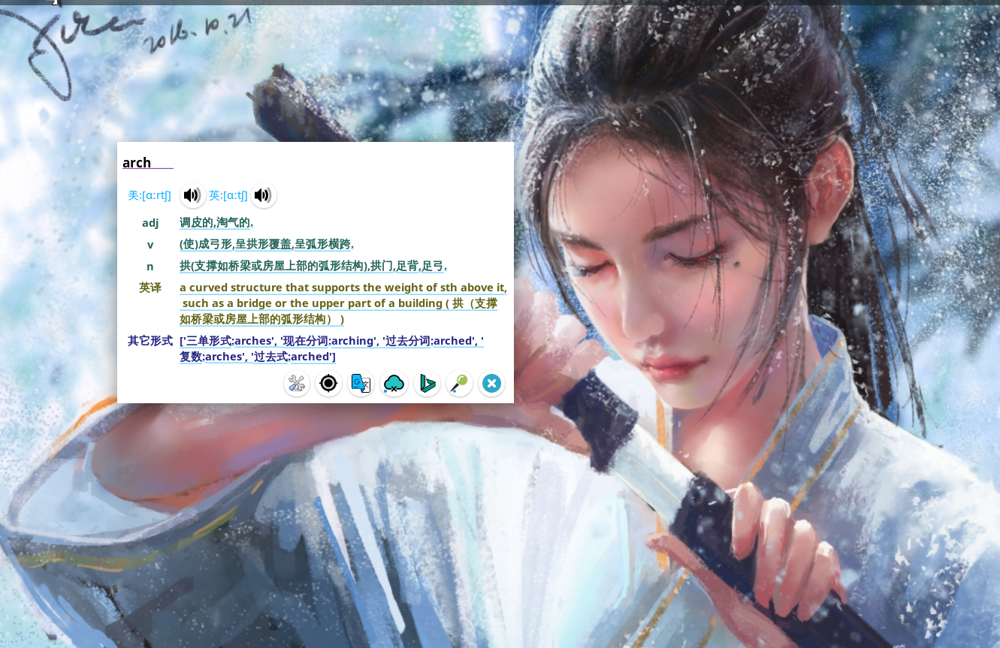
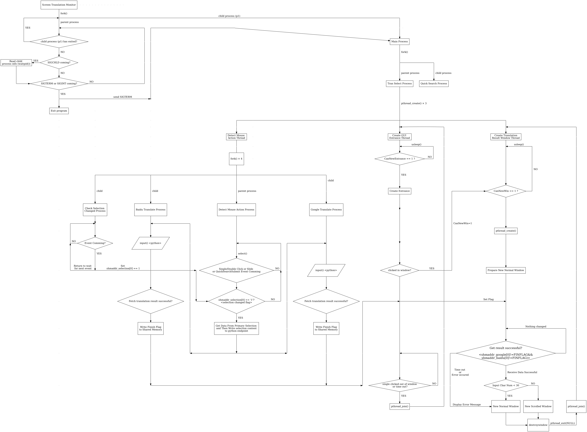

## 测试发现Deepin问题稍多，Ubuntu和Arch目前没有发现明显问题
## Deepin 离线功能若要正常使用，请将Python更新到3.8及以上

<br> 

### 注意安装后将 `/etc/gdm/custom.conf` 里的 `#WaylandEnable=false` 前面的 `#`号注释掉，使用Xorg服务，否则xdotool无法工作

### 新更新变动：百度在线翻译已改为必应翻译，原因：百度翻译不仅针对爬虫，连浏览器打开的翻译界面超过一定时间后连接同样失效，体验很差，经常超时，暂时弃用之

### 再更新: 添加暂时忽略功能，快捷键 Alt+V 后选中特定软件的窗口，翻译软件关闭之前都不会在该窗口弹出翻译图标，如需取消，再次Alt+V选中同一个软件窗口即可。

# 一. 程序功能
## (一). 目前功能
### 1. 屏幕取词翻译 -- 中英互译 （全局）
### 2. 快速搜索功能 -- 快捷键调出搜索框，输入后回车获取翻译（全局）
### 3. 添加了离线支持 -- 仅支持单词（总词数约38万）
### 4. 截图翻译    --  屏幕上短时间内点击不同的3个点触发(或Alt+d)，形成的三角形不能过小 <br><br>
  * 为尽可能防止误触截图功能，三个点基本在一条线上的情况会被抛弃，如果触发了之后想取消本次截图识别，点击鼠标右键即可 
  * 目前基本不支持中文，识别准确率孱弱，有时间再改进。
  
  

  #### Ubuntu 19.04 测试通过:

   

  #### Arch Linux 测试通过:

    

 #### Deepin Linux 测试通过
 


### 按键功能说明: 
* 切换谷歌百度翻译


# 二. 运行效果图示 
* [x] 截图翻译演示<br><br>
 <br><br>

* [x] 浏览器演示<br><br>
 

<br> 

* [x] 快速查找功能 \<Alt-J> 触发， Ctrl-C 或 ESC 关闭，翻译界面只支持ctrl-C关闭，窗口失焦状态ctrl-c同样适用，要关闭此功能需修改源码，后期发布详情 （修改源码可更改快捷键，详情见issue）<br><br>


<br>

# 三. 程序目前已知问题

- [ ] **程序只支持Xorg的桌面，并且系统必须禁用Wayland。** 

<br> 

# 四. 程序编译安装
1. 先将源码克隆到本地 

        $ git clone https://github.com/poemdistance/ScreenTranslation --recursive

    如果代码已经下载过一次并做了修改，需要同步到上游到最新状态覆盖本地的，参考：
    [Git 下游更改后强行恢复至上游最新状态, 更新submodules至最新状态](https://poemdear.com/2019/08/29/git-%e4%b8%8b%e6%b8%b8%e6%9b%b4%e6%94%b9%e5%90%8e%e5%bc%ba%e8%a1%8c%e6%81%a2%e5%a4%8d%e8%87%b3%e4%b8%8a%e6%b8%b8%e6%9c%80%e6%96%b0%e7%8a%b6%e6%80%81-%e6%9b%b4%e6%96%b0submodules%e8%87%b3%e6%9c%80/)
  

2. cd到src目录  

        $ cd ScreenTranslation/src
   
3. 安装依赖  Xlib X11 Xtst Xext gtk3开发环境(gtk.h, gtkwindow.h)
 
   * For system base on Debian  (Ubuntu, Kali etc.)

          $ sudo apt-get install build-essential gnome-devel libx11-dev libxtst-dev
          $ sudo apt-get install python3-pip liblzma-dev
          $ sudo apt-get install xdotool
          $ sudo apt install  tesseract-ocr libtesseract-dev meson
          $ sudo pip3 install pytesseract tesseract pillow meson
          $ sudo apt install libcanberra-gtk3-0  libcanberra-gtk3-dev  libcanberra-gtk3-module


   * For Arch Linux 

          $  sudo pacman -S gtk3  libxtst libx11  xdotool  python-pip  
          $  sudo pacman -S tesseract meson
          $  sudo pip3 install pytesseract tesseract pillow meson

          #图像识别相关依赖作者安装太久了，不知道有没有漏掉什么...

  
4. 终端执行命令完成项目安装
        
        make prepare && make && make install


<br><br>

# 五. 离线库下载与安装

* 百度云速度太慢，不考虑作为上传地址，github有上传大小限制，也放弃了，选择了一个国外的云盘Mega，速度很不错，限流不限速，需要使用离线功能的童鞋可能需要先注册一个Mega账号，下载好后再往下操作。
 
  * 下载链接:https://mega.nz/#F!BuJQmSZA!aRwJ65QBHwnq55qy2S4_Bw
 
 <br>

1. 解压下载文件 <br> 

* 将`WordMp3`放置于家目录，`dict.sql`请随意. <br>
  解压命令:

         tar xfv offlineTranslationResources.tar.gz 


2. 安装数据库 
 
 * For Arch <br>
                
         sudo pacman -s mariadb
   
  * For Debian serias
        
         sudo apt install  mariadb-server 
   
3. 创建数据库并导入dict.sql (请在普通用户模式下执行) 


* 
        #启动数据库
        sudo mysql -u root -p  #在普通用户模式下执行，然后一路回车设置空密码

<br> 

 *      # 出现如 MariaDB [(none)]> 画面时依次输入下面的命令(注意替换YOUR_SYSTEM_USER为自己的用户名： 
  
        CREATE USER 'YOUR_SYSTEM_USER'@'localhost' IDENTIFIED BY '';
        GRANT ALL PRIVILEGES ON *.* TO 'YOUR_SYSTEM_USER'@'localhost';
        FLUSH PRIVILEGES;
        create database dict;
        exit;

        #注意如此操作后以后都必须用用户名连接数据库，想要使用其他方法适应项目的可以自己探索。

<br> 

* 
        #终端操作命令导入数据库
        mysql -h127.0.0.1 -u$USER -p dict < dict.sql #终端命令导入数据库

* 
         #设置Mariadb自启动

         systemctl enable mariadb
         systemctl start mariadb

<br>


# 六. 使用过程中的问题
 
1. 运行后长时间未使用软件，在第一次双击后可能会不弹出图标，或者翻译结果呈现上一次未知的复制，是因为复制操作有延时，程序获取成了上一次的复制结果
 
2. 程序有较小几率呈现出上一次的翻译结果，原因是上一次结果获取较慢，直到在这一次中才呈现出来，打乱了步伐

3. 程序有较小几率显示不完美，也跟翻译速度影响有关

4. 百度或者谷歌翻译如果在翻译过程中出了问题，可能是网络原因，也可能是代码本身的Bug，由于翻译结果的不确定性，不保证已经将全部因素考虑进去，有可能翻译某些特定情况的时候使程序奔溃，重启便可。如果多次选中同一个文本都产生崩溃，那便是代码的问题。如果重启后一切恢复，便是网络问题，即有可能是网络不好，或者百度的反爬虫机制导致的。

5. 如果想协助作者完善此软件，请在程序崩溃后将日志文件 `/var/log/mstran.log`发送至作者github同名gmail邮箱:`poemdistance@gmail.com` 
 
6. 软件是有桌面图标的，安装成功并重启后按Super键，搜索Mstran即可找到，点击图标会打开或者重启翻译软件。


# 七. 更新上游项目并安装

## 1. 项目更新 

步骤一.

          #注意这条命令自始至终只需要在项目中执行一次

          git remote add upstream https://github.com/poemdistance/ScreenTranslation  

步骤二.
          
          #注意以下命令会覆盖掉本地已有的修改

          git fetch upstream
          git checkout master
          git reset --hard upstream/master

步骤三.

          git submodule foreach git pull origin master 

## 2. 项目安装

步骤四. <编译/安装项目> 

        参照上面的安装步骤 2  4  5  （更新不需要重启)


<br> 

# 八. 程序运行与停止

  * **NOTE**: **电脑如果安装了wayland，需要禁用**，不然终端中无法正常使用xdotool,方法如下：<br>
     *  打开/etc/gdm/custom.conf
        添加如下两行(完成后需要重启)
        ```
        [daemon]
        WaylandEnable=false
        ``` 
  * **相关依赖**： 
      1. C语言库: Xlib X11 Xtst Xext gtk3开发环境
      2. 终端命令行工具: xdotool, ps, awk, tail 

        
   * **在某些应用中禁用取词翻译** <br>

       找到`fordetectMouse.c`中的如下内容:

         const static char wantToIgnore[][20] = {
           "VirtualBox",
           "VirtualBoxVM",
           "vlc",
           "qemu-system-arm",
           "nautilus",
           "eog",
           "gimp-2.10"
         };

      **将需要忽略的应用名称添加进数组保存，重新编译项目并安装。**

1. 直接运行编译后生成的可执行文件mstran (**软件有应用图标，名为Mstran，点击图标亦可运行**)
 
        $  mstran 
    
      这种情况会有很多输出信息，一般是拿来作为调试信息的<br><br>

        $  mstran > /dev/null &
  
     放置在后台执行，重定向输出到/dev/null <br> <br>

     停止运行:   

        $ bash ~/.stran/stop.sh (或终端直接执行stoptran)


<br> 


# 九. 程序运行异常问题

   
1. 如果**运行报错failed to open mice的问题**，这个是因为没有权限打开文件进行读写导致的，可以有如下解决办法：    
    * **方法一: 添加当前用户到/dev/input/mice的用户组中**：<br>
        * a. 先查明此文件设备所在用户组,使用命令:<br> 
  
                $ ls -l /dev/input/mice

           b. 得到结果类似如下:<br>  

                crw-rw---- 1 root input 13, 63 Jul 27 09:09 /dev/input/mice

           c. 其中的input即是其所在用户组，得到后使用如下命令**添加用户到input用户组并重启系统**:<br> 

                $ sudo usermod -aG input $USER
            
            **Note**: **如果设备文件没有用户组，请先手动设置规则添加，网上很多相关内容，这里不赘述.** <br><br>

    * **方法二: 使用sudo执行此程序**: <br> 
     
           sudo mstran 

         中途测试过程中以root用户或者说sudo执行时Xdisplay发生过 No protocol specified的错误，所以此方法不一定奏效，但也可能是当时系统忘记关闭Wayland导致的。

<br>

# 十. 支持作者

  * 看都看到这里了，打赏一个呗 :P
  
     

 &nbsp;&nbsp;&nbsp;&nbsp;&nbsp;&nbsp;&nbsp;&nbsp; &nbsp;&nbsp;&nbsp;&nbsp;&nbsp;&nbsp;&nbsp;&nbsp;&nbsp;&nbsp;&nbsp;&nbsp;&nbsp;&nbsp;&nbsp;&nbsp;&nbsp;&nbsp;支付宝 &nbsp;&nbsp;&nbsp;&nbsp;&nbsp;&nbsp;&nbsp;&nbsp;&nbsp;&nbsp;&nbsp;&nbsp;&nbsp;&nbsp;&nbsp;&nbsp;&nbsp;&nbsp;&nbsp;&nbsp;&nbsp;&nbsp;&nbsp;&nbsp;&nbsp;&nbsp;&nbsp;&nbsp;&nbsp;&nbsp;&nbsp;&nbsp;&nbsp;&nbsp;&nbsp;&nbsp;&nbsp;&nbsp;&nbsp;&nbsp;&nbsp;&nbsp;&nbsp;&nbsp;&nbsp;&nbsp;&nbsp;&nbsp;&nbsp;&nbsp;&nbsp;&nbsp;&nbsp;&nbsp;&nbsp;&nbsp;&nbsp;&nbsp;&nbsp; 微信

# 十一. 程序内部逻辑流程图

